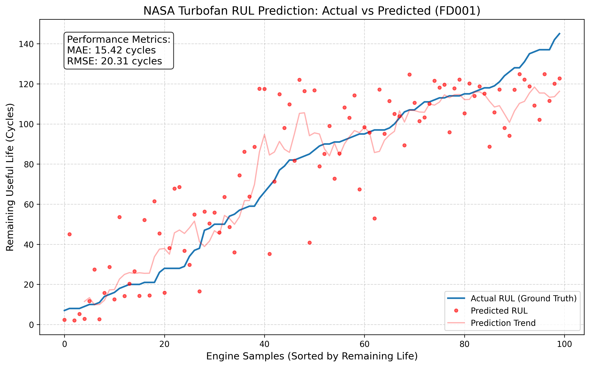

a# ✈️ Turbofan Engine Predictive Maintenance
### Estimating Remaining Useful Life (RUL) with NASA C-MAPSS

## 📌 Project Overview
This project focuses on **proactive maintenance** for aircraft engines. Using the NASA C-MAPSS dataset, I developed a machine learning pipeline that predicts how many flight cycles an engine has left before it reaches a failure state.

---

## 📊 Performance Summary
The current baseline model uses a **Random Forest Regressor** with customized rolling-window features.

| Metric | Score | Interpretation |
| :--- | :--- | :--- |
| **R² Score** | **0.76** | Captures 76% of the variance in engine decay. |
| **MAE** | **15.42** | Average prediction is within ~15 flights of truth. |
| **RMSE** | **20.31** | Penalizes larger errors; shows robust stability. |

### Prediction Accuracy


---

## 🛠️ The Engineering Pipeline

### 1. Feature Engineering
Instead of using raw sensor data, I engineered features to capture **temporal trends**:
* **Sensor Selection:** Focused on top-performing sensors (s_11, s_9, s_4, s_12).
* **Rolling Statistics:** Calculated moving averages to smooth sensor noise.
* **Feature Scaling:** Standardized inputs using `StandardScaler`.

### 2. Project Structure
```text
├── data/               # Raw and processed datasets (Git ignored)
├── models/             # Serialized (.pkl) model files
├── notebooks/          # Exploratory Data Analysis (EDA)
├── results/            # Prediction CSVs and performance plots
├── src/                # Modular Python scripts
│   ├── data.py         # Automated data fetcher
│   ├── preprocess.py   # Cleaning & Feature Engineering
│   ├── train.py        # Training & Validation
│   ├── predict.py      # Inference & Scoring
│   └── visualize.py    # Performance Graphing
├── .gitignore          # Prevents large data/venv files from being tracked
└── requirements.txt    # Dependency list
```
---

### Part 3: The Installation & Setup

---

## 🚀 Getting Started

### Prerequisites
* **Python 3.8+**
* **Virtual environment** (recommended for dependency isolation)

### Installation & Setup

1. **Clone the repository:**
   ```bash
   git clone [https://github.com/JayParekh-MechAI/Turbofan-Predictive-Maintenance.git](https://github.com/JayParekh-MechAI/Turbofan-Predictive-Maintenance.git)
   cd Turbofan-Predictive-Maintenance
```