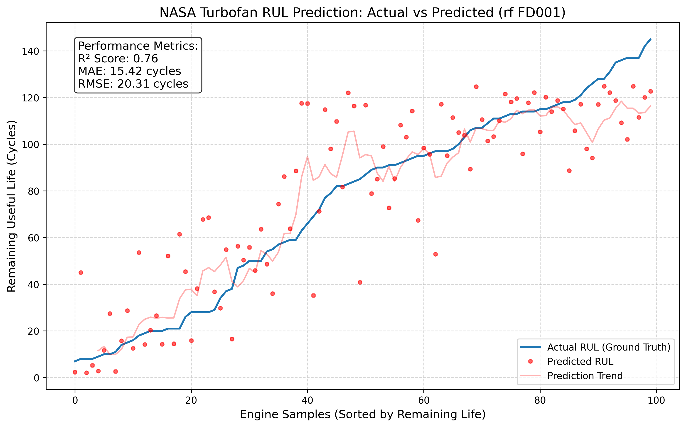
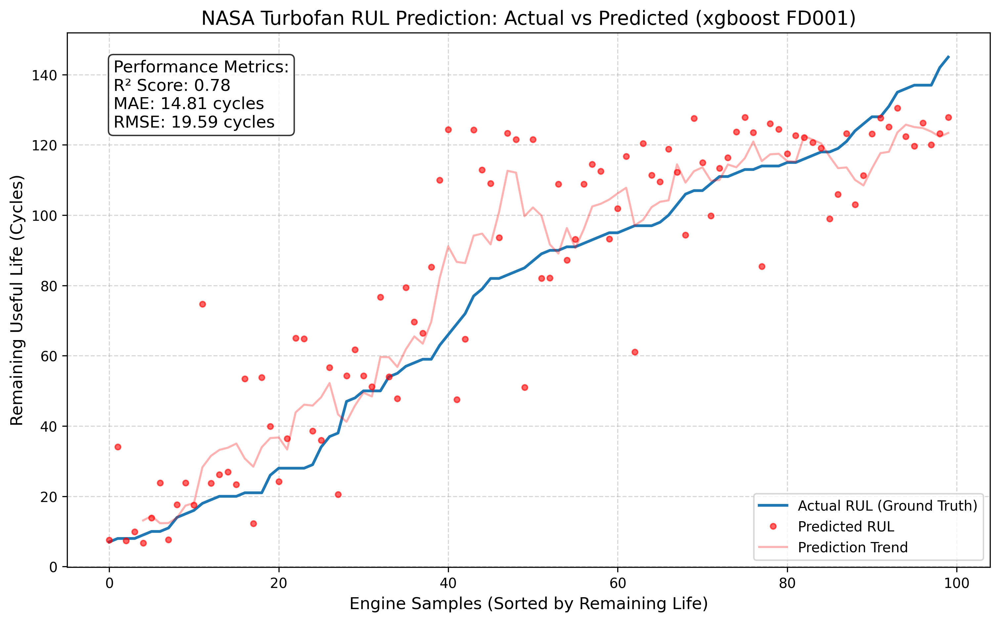
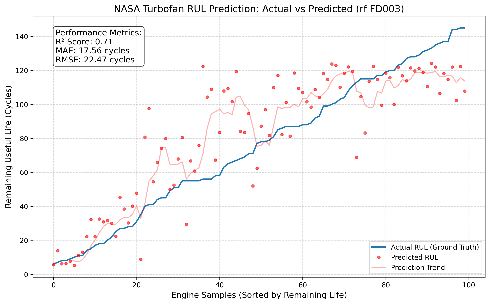
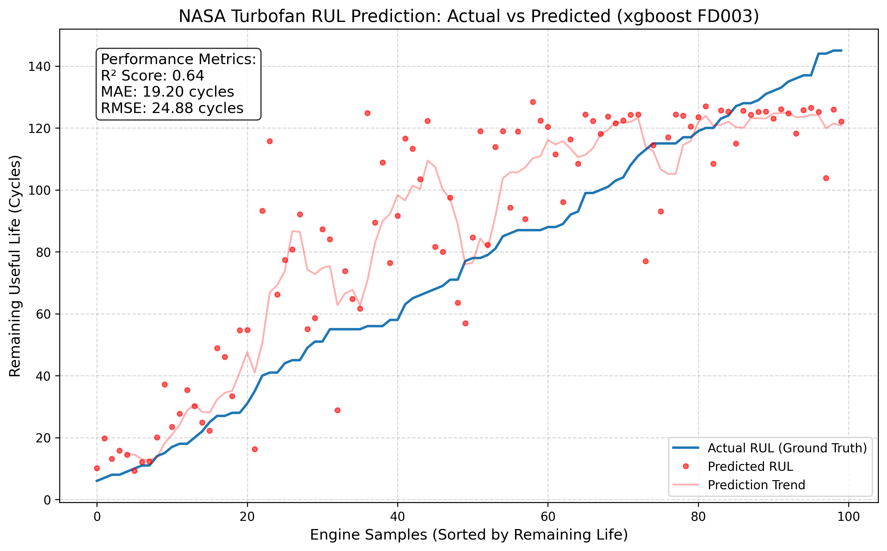

# ✈️ Turbofan Engine Predictive Maintenance
### Estimating Remaining Useful Life (RUL) with NASA C-MAPSS

## 📌 Project Overview
This project focuses on **proactive maintenance** for aircraft engines. Using the NASA C-MAPSS dataset, I developed a machine learning pipeline that predicts how many flight cycles an engine has left before it reaches a failure state.

---

## 📊 Performance Summary
I benchmarked a **Random Forest (RF)** baseline against an **XGBoost (XGB)** regressor. While XGBoost showed superior precision on single-mode failure data (FD001), Random Forest proved more robust on complex, dual-mode failure data (FD003).

| Dataset | Model | R² Score | MAE | RMSE | Status |
| :--- | :--- | :--- | :--- | :--- | :--- |
| **FD001** | Random Forest | 0.76 | 15.42 | 20.31 | Baseline |
| **FD001** | **XGBoost** | **0.78** | **14.81** | **19.59** | 🏆 **Best for FD001** |
| **FD003** | **Random Forest**| **0.71** | **17.56** | **22.47** | 🏆 **Best for FD003** |
| **FD003** | XGBoost | 0.64 | 19.20 | 24.88 | Overfit Suspected |

> **Key Insight:** XGBoost outperformed the baseline on FD001 by ~4%. However, for FD003, the Random Forest's ensemble averaging provided better generalization against the increased noise of dual failure modes.

> **Note:** Interpretation of Metrics — MAE represents the average error in flight cycles. The model shows higher precision in the "Final 50 Cycles" (Near-Failure), which is critical for maintenance scheduling.

### 📈 Prediction Accuracy
Click to expand the results for each validated dataset and compare model architectures:

<details>
<summary><b>View FD001 Results (Single Failure Mode)</b></summary>

#### Random Forest (Baseline)


#### XGBoost (Optimized)


* **Insights:** XGBoost provided the best performance for FD001, achieving a tighter fit to the ground truth and reducing MAE to **14.81**. The model is highly reliable in the "Final 50 Cycles" critical window.
</details>

<details>
<summary><b>View FD003 Results (Dual Failure Modes)</b></summary>

#### Random Forest (Baseline)


#### XGBoost (Experimental)


* **Insights:** On this complex dataset with dual failure modes, the **Random Forest** actually generalized better with an MAE of **17.56**. XGBoost appeared to overfit to the noise, resulting in a higher MAE of **19.20**.
</details>

---

## 🛠️ The Engineering Pipeline

### 1. Feature Engineering
Instead of using raw sensor data, I engineered features to capture **temporal trends**:
* **Sensor Selection:** Focused on top-performing sensors (s_11, s_9, s_4, s_12).
* **Rolling Statistics:** Calculated moving averages to smooth sensor noise.
* **Feature Scaling:** Standardized inputs using `StandardScaler`.

### 2. Project Structure
```text
├── data/               # Raw and processed datasets (Git ignored)
├── models/             # Serialized (.pkl) model files
├── notebooks/          # Exploratory Data Analysis (EDA)
├── results/            # Prediction CSVs and performance plots
├── src/                # Modular Python scripts
│   ├── data.py         # Automated data fetcher
│   ├── preprocess.py   # Cleaning & Feature Engineering
│   ├── train.py        # Training & Validation
│   ├── predict.py      # Inference & Scoring
│   └── visualize.py    # Performance Graphing
├── .gitignore          # Prevents large data/venv files from being tracked
└── requirements.txt    # Dependency list
```
---


## 🚀 Getting Started

### Prerequisites
* **Python 3.8+**
* **Virtual environment** (recommended for dependency isolation)

### Installation & Setup

1. **Clone the repository:**
   ```bash
   git clone [https://github.com/JayParekh-MechAI/Turbofan-Predictive-Maintenance.git](https://github.com/JayParekh-MechAI/Turbofan-Predictive-Maintenance.git)
   cd Turbofan-Predictive-Maintenance
    ```

2. **Create & Activate Virtual Environment:**
    ```bash
    python -m venv .venv
    ```
    * **Windows:** `.venv\Scripts\activate`
    * **Mac/Linux:** `source .venv/bin/activate`

3. **Install Dependencies:**
    ```bash
    pip install -r requirements.txt
    ```
---

## 🏃 Execution Flow
Run the scripts in this specific order to reproduce the results:

    # 1. Download NASA data
    python src/setup_data.py

    # 2. Process data and engineer features
    python src/preprocess.py

    # 3. Train the Random Forest model
    python src/train.py

    # 4. Generate final predictions & plot results
    python src/predict.py
    python src/visualize.py

---

## 🔮 Future Roadmap

- [ ] Scalability: Support FD002 and FD004 multivariate datasets

- [ ] Multi-Model Comparison: Implement XGBoost and LSTM architectures.

- [ ] Interactive Dashboard: Build a Streamlit app for real-time monitoring.

- [ ] Cross-Dataset Validation: Extend support to FD002 and FD004.

- [ ] API Deployment: Wrap the model in a FastAPI endpoint for real-time inference.

---

## 🤝 Contributing
Contributions, issues, and feature requests are welcome! If you have suggestions for improving the model accuracy or adding new features, feel free to open an **issue** or submit a **pull request**.

---

## 👤 Author
**Jay Parekh**
* **LinkedIn:** [Jay Parekh](https://www.linkedin.com/in/jayspage/)
* **Email:** [jayparekh01@hotmail.co.uk](mailto:jayparekh01@hotmail.co.uk)
* **GitHub:** [@JayParekh-MechAI](https://github.com/JayParekh-MechAI)

---